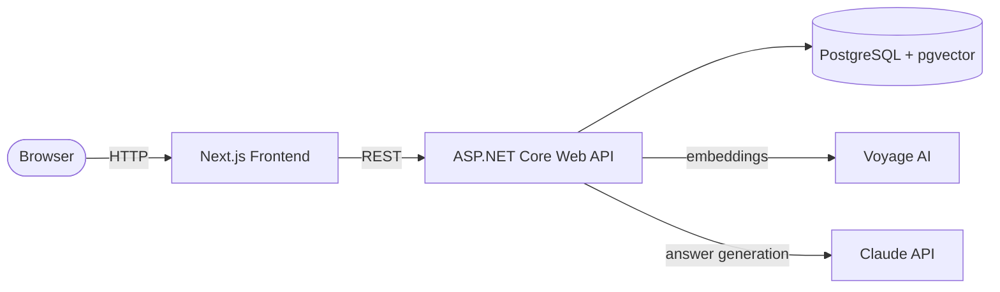

# Chat With Your Documents

An AI-powered **RAG** application: upload your PDFs and ask questions about them in plain language. Answers are grounded in *your* documents, and every response cites the exact source passages it was built from — so you can trust it, not just read it.

Built from scratch as an end-to-end system-design showcase: a production-minded **ASP.NET Core** backend, a **Next.js** frontend, **PostgreSQL + pgvector** for storage and semantic search, and **Docker** for a one-command local run.


> **RAG (Retrieval-Augmented Generation):** instead of asking a language model a question blindly, the app first retrieves the most relevant passages from your own documents, then asks the model to answer using only that context. Responses are grounded in your data rather than the model's training memory — and because the retrieved passages are known, each answer can be traced back to its sources.

---

## Features

- **Document ingestion** — upload a PDF and have it automatically parsed, split into passages, and embedded for semantic search.
- **Grounded question answering** — ask in natural language and get answers built strictly from your documents.
- **Source citations** — every answer exposes the exact passages it drew from, so responses are verifiable.
- **Streaming responses** — answers render token-by-token as they are generated.
- **Asynchronous pipeline** — uploads return instantly; embedding runs on a background worker, with a live `Processing → Ready` status lifecycle.
- **One-command local run** — the whole stack (frontend, backend, database) comes up with a single Docker Compose command.

---

## Architecture



The backend is deliberately the center of gravity; the frontend is a thin client. There are two core flows:

**Ingestion (adding a document).** The API accepts a PDF, extracts its text, splits it into overlapping chunks, generates a vector embedding for each chunk via Voyage AI, and stores the chunks and their vectors in PostgreSQL. This runs on a background worker, so the upload request returns immediately and the document's status transitions from `Processing` to `Ready` when embedding completes.

**Retrieval (answering a question).** The API embeds the user's question, performs a vector-similarity search in PostgreSQL to find the most relevant chunks, sends those chunks plus the question to the Claude API with an instruction to answer only from the provided context, and streams the grounded answer back to the client — along with the chunks that were used, for citation.

---

## Tech stack

| Layer | Technology |
|---|---|
| Frontend | Next.js (TypeScript, App Router) |
| Backend | ASP.NET Core Web API (.NET 9, C#) |
| Database | PostgreSQL 16 with the pgvector extension |
| ORM | Entity Framework Core (Npgsql) |
| Embeddings | Voyage AI (`voyage-4-lite`, 1024-dim) |
| Answer generation | Claude API |
| PDF parsing | UglyToad.PdfPig |
| Orchestration | Docker + Docker Compose |

---

## Design decisions and trade-offs

The interesting part of this project is *why* it's built the way it is.

- **One repository, not many.** The frontend and backend live together so a single `docker compose up` runs the whole system and a change spanning both sides lands in one atomic commit. At the scale of many shared packages I'd reach for a monorepo tool like Nx; if the services needed independent deployment by separate teams, I'd split them into separate repos.

- **PostgreSQL + pgvector instead of a dedicated vector database.** One datastore holds both the relational data and the searchable embeddings, which keeps operations simple and avoids syncing two systems. A specialized vector database would pay off at very large scale or with heavy filtering needs; for this workload, one database doing both is the cleaner choice.

- **Asynchronous ingestion via a background worker.** Uploads enqueue work on an in-memory channel processed by a hosted `BackgroundService`, so the request thread never blocks on parsing and embedding. This is what makes the `Processing → Ready → Failed` status lifecycle meaningful. Trade-off: the in-memory queue loses in-flight jobs on restart — acceptable for this single-instance app, and the natural upgrade path is a durable queue.

- **Tunable chunking (size + overlap).** Chunk size and overlap are exposed as constants because they are the central lever on retrieval quality — smaller chunks give more precise matches, larger chunks give more context. Keeping them adjustable makes that trade-off explicit.

- **Distinct document vs. query embeddings.** Voyage embeds indexed documents and search queries with different `input_type` settings; using each appropriately measurably improves retrieval relevance.

- **Secrets live only in the backend.** API keys are read from server-side configuration and never reach the browser — the frontend always calls this API, and this API calls the external services.

- **Source citations as a first-class feature.** Surfacing the passages behind each answer is what separates a grounded document assistant from a chatbot that can confidently make things up.

- **Non-enumerable identifiers.** Entities use GUID primary keys, so IDs exposed through the API can't be trivially guessed or walked.

---

## Getting started

### Prerequisites

- [Docker Desktop](https://www.docker.com/products/docker-desktop/) (running)
- A **Voyage AI** API key — free tier, from [voyageai.com](https://www.voyageai.com/) (used for embeddings)
- An **Anthropic** API key — from [console.anthropic.com](https://console.anthropic.com/) (used for answer generation)

### Configure

Create a `.env` file in the project root (this file is git-ignored and never committed):

```env
POSTGRES_USER=postgres
POSTGRES_PASSWORD=change-me
POSTGRES_DB=chatwithdocs
VOYAGE_API_KEY=your-voyage-key
ANTHROPIC_API_KEY=your-anthropic-key
```

A `.env.example` with blank values is included as a template.

### Run

```bash
docker compose up --build
```

This builds the backend and frontend, starts PostgreSQL with pgvector, applies database migrations automatically on startup, and wires all three services together.

- Backend health check: <http://localhost:5000/health>
- Frontend: <http://localhost:3000>

Stop with `Ctrl+C`, then `docker compose down` to remove the containers.

### Try the ingestion API

```bash
curl -i -F "file=@/path/to/document.pdf" http://localhost:5000/api/documents
```

The upload returns immediately; the document is embedded in the background and its status becomes `Ready` shortly after.

---

## Project structure

```
.
├── backend/            ASP.NET Core Web API (ingestion, retrieval, orchestration)
├── frontend/           Next.js app (document library + chat UI)
├── docker-compose.yml  Orchestrates backend, frontend, and PostgreSQL
├── .env.example        Template for required environment variables
└── README.md
```

---

## API

| Method | Endpoint | Description |
|---|---|---|
| `GET` | `/health` | Service health check |
| `POST` | `/api/documents` | Upload a PDF for ingestion (multipart/form-data) |

_Additional endpoints for listing documents and asking questions are added in later phases (see below)._

---

## Status and roadmap

This project is built in disciplined, reviewable phases.

- [x] Dockerized skeleton — backend, frontend, PostgreSQL + pgvector
- [x] Data model and migrations
- [x] PDF ingestion and embedding pipeline
- [ ] Retrieval and streaming chat endpoint
- [ ] Frontend: document library, chat UI, source citations
- [ ] Polish: empty states, loading, error handling
- [ ] Automated tests and CI
- [ ] Public online deployment

---

## License

Released under the MIT License.
