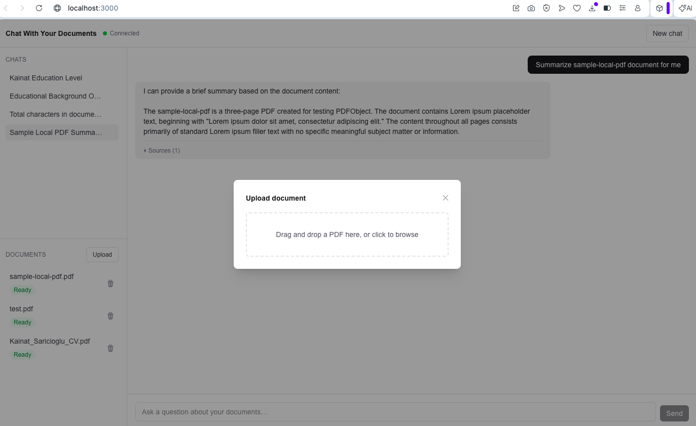
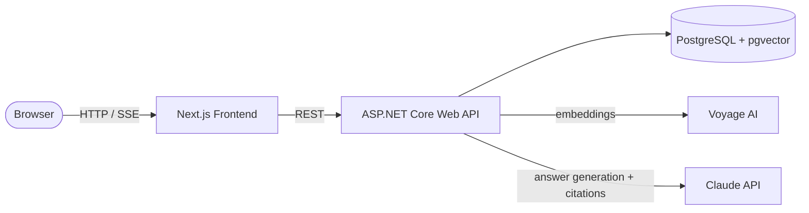

# Chat With Your Documents

An AI-powered **RAG** application: upload your PDFs and ask questions about them in plain language. Answers **stream in live**, are grounded strictly in *your* documents, and **cite the exact passages** they came from — and every conversation is **saved with an auto-generated title**, like ChatGPT.

Built from scratch as an end-to-end system-design showcase: a **Clean Architecture** ASP.NET Core backend, a **Next.js** frontend, **PostgreSQL + pgvector** for storage and semantic search, and **Docker** for a one-command local run.


> **RAG (Retrieval-Augmented Generation):** instead of asking a language model a question blindly, the app first retrieves the most relevant passages from your own documents, then asks the model to answer using only that context. Responses are grounded in your data rather than the model's training memory — and because the retrieved passages are known, each answer can be traced back to its sources.




---

## Features

- **Document ingestion** — upload a PDF and have it automatically parsed, split into overlapping passages, and embedded for semantic search. Ingestion runs on a background worker, so uploads return instantly and each document moves through a live `Processing → Ready → Failed` status.
- **Grounded question answering** — ask in natural language and get an answer built strictly from your documents.
- **Trustworthy source citations** — using Anthropic's native citations, every answer exposes the exact passages it actually used. Off-topic questions cite nothing at all, so the app never fabricates sources or leaks unrelated content.
- **Streaming responses** — answers render token-by-token as they are generated.
- **Persistent chat history** — every conversation is saved with an automatically generated title, and past chats can be reopened with their answers and sources intact.
- **Document library** — upload, watch live status, and delete documents from a sidebar.
- **One-command local run** — the whole stack (frontend, backend, database) comes up with a single Docker Compose command.

---

## Architecture



The backend is deliberately the center of gravity; the frontend is a thin client. There are two core flows:

**Ingestion (adding a document).** The API accepts a PDF, extracts its text, splits it into overlapping chunks, generates a vector embedding for each chunk via Voyage AI, and stores the chunks and their vectors in PostgreSQL. This runs on a background worker, so the upload request returns immediately and the document's status transitions from `Processing` to `Ready` when embedding completes.

**Retrieval (answering a question).** The API embeds the user's question, performs a vector-similarity search in PostgreSQL to find the most relevant chunks, and sends those chunks plus the question to the Claude API — with citations enabled and an instruction to answer only from the provided context. The grounded answer is streamed back to the client over Server-Sent Events, followed by the exact passages Claude cited.

---

## Backend: Clean Architecture

The backend is organized into four projects, with dependencies pointing strictly inward. The rule is enforced by project references, so a violation won't compile — the architecture is guaranteed by the build, not by discipline.

```
backend/src/
├── ChatWithDocs.Domain/          # entities & enums — depends on nothing
├── ChatWithDocs.Application/     # use cases (MediatR), interfaces, DTOs — depends on Domain
├── ChatWithDocs.Infrastructure/  # EF Core, Voyage, Claude, PdfPig, background worker — implements the interfaces
└── ChatWithDocs.Api/             # thin controllers + composition root — wires it all together
```

Core logic depends only on abstractions it owns (e.g. `IEmbeddingService`, `IChatService`, repositories); the concrete Voyage, Claude, and EF Core implementations plug in from the outside via dependency injection. This keeps the domain testable in isolation and makes each external dependency swappable.

---

## Tech stack

| Layer             | Technology                                     |
| ----------------- | ---------------------------------------------- |
| Frontend          | Next.js (TypeScript, App Router)               |
| Backend           | ASP.NET Core Web API (.NET 9, C#)              |
| Application layer | MediatR (CQRS-style commands & queries)        |
| Database          | PostgreSQL 16 with the pgvector extension      |
| ORM               | Entity Framework Core (Npgsql)                 |
| Embeddings        | Voyage AI (`voyage-4-lite`, 1024-dim)          |
| Answer generation | Claude API (official Anthropic C# SDK)         |
| PDF parsing       | UglyToad.PdfPig                                |
| Orchestration     | Docker + Docker Compose                        |

---

## Design decisions and trade-offs

The interesting part of this project is *why* it's built the way it is.

- **Clean Architecture, enforced by the compiler.** Four projects with inward-only dependencies, so the domain literally cannot reference infrastructure. Two pragmatic exceptions were made deliberately: a dependency-free `Pgvector.Vector` value type is allowed in the domain to keep the vector-search mapping intact, and an `IUnitOfWork` keeps a document and its chunks saved atomically across two repositories.

- **PostgreSQL + pgvector instead of a dedicated vector database.** One datastore holds both the relational data and the searchable embeddings, which keeps operations simple and avoids syncing two systems. A specialized vector database would pay off at very large scale; for this workload, one database doing both is the cleaner choice.

- **Retrieval grounded by citations, not by a distance threshold.** Rather than guessing a similarity cutoff to filter results, the app lets Claude's native citations decide what actually grounded the answer. Sources reflect only the passages cited, and off-topic questions cite nothing — more accurate and more robust than a hand-tuned threshold.

- **Asynchronous ingestion via a background worker.** Uploads enqueue work on an in-memory channel processed by a hosted `BackgroundService`, so the request never blocks on parsing and embedding. This is what makes the `Processing → Ready → Failed` lifecycle meaningful. Trade-off: the in-memory queue loses in-flight jobs on restart — acceptable for a single-instance app, with a durable queue as the upgrade path.

- **Distinct document vs. query embeddings.** Voyage embeds indexed documents and search queries with different `input_type` settings; using each appropriately measurably improves retrieval relevance.

- **Tunable chunking (size + overlap).** Chunk size and overlap are exposed as constants because they are the central lever on retrieval quality — smaller chunks give more precise matches, larger chunks give more context.

- **Persisted history with denormalized sources.** Each saved message stores its cited passages as JSON alongside it, so reopening an old conversation still shows its citations even if the underlying document is later deleted. Conversation titles are generated cheaply and fall back gracefully if generation fails.

- **Single-turn generation (by design, for now).** Conversations are grouped and persisted for history and display, but each question is retrieved and answered independently — multi-turn context with query rewriting is a deliberate, noted future enhancement rather than a half-built feature.

- **Secrets live only in the backend.** API keys are read from server-side configuration and never reach the browser — the frontend always calls this API, and this API calls the external services.

- **Non-enumerable identifiers.** Entities use GUID primary keys, so IDs exposed through the API can't be trivially guessed or walked.

---

## Getting started

### Prerequisites

- [Docker Desktop](https://www.docker.com/products/docker-desktop/) (running)
- A **Voyage AI** API key — free tier, from [voyageai.com](https://www.voyageai.com/) (used for embeddings)
- An **Anthropic** API key — from [console.anthropic.com](https://console.anthropic.com/) (used for answer generation)

### Configure

Create a `.env` file in the project root (git-ignored, never committed):

```env
POSTGRES_USER=postgres
POSTGRES_PASSWORD=change-me
POSTGRES_DB=chatwithdocs
VOYAGE_API_KEY=your-voyage-key
ANTHROPIC_API_KEY=your-anthropic-key
```

A `.env.example` with blank values is included as a template.

### Run

```bash
docker compose up --build
```

This builds the backend and frontend, starts PostgreSQL with pgvector, applies database migrations automatically on startup, and wires all three services together.

- Frontend: <http://localhost:3000>
- Backend health check: <http://localhost:5000/health>

Then, in the app: upload a PDF, wait for it to reach **Ready**, and ask a question — the answer streams in with its cited sources, and the conversation is saved to the history sidebar. Stop with `Ctrl+C`, then `docker compose down`.

---

## Project structure

```
.
├── backend/
│   ├── src/
│   │   ├── ChatWithDocs.Domain/          # entities, enums
│   │   ├── ChatWithDocs.Application/      # MediatR use cases, interfaces, DTOs
│   │   ├── ChatWithDocs.Infrastructure/   # EF Core, Voyage, Claude, PdfPig, worker
│   │   └── ChatWithDocs.Api/              # controllers, composition root
│   ├── ChatWithDocs.sln
│   └── Dockerfile
├── frontend/
│   └── src/
│       ├── app/                           # Next.js routing & layout
│       ├── components/                    # layout + shared UI primitives
│       ├── features/                      # documents, chat (feature-organized)
│       └── lib/                           # API client, shared types
├── docker-compose.yml                     # orchestrates backend, frontend, PostgreSQL
├── .env.example
└── README.md
```

---

## API

| Method   | Endpoint                   | Description                                                    |
| -------- | -------------------------- | ------------------------------------------------------------- |
| `GET`    | `/health`                  | Service health check                                          |
| `POST`   | `/api/documents`           | Upload a PDF for ingestion (multipart/form-data)              |
| `GET`    | `/api/documents`           | List all documents with their status                          |
| `DELETE` | `/api/documents/{id}`      | Delete a document (cascades to its chunks)                    |
| `POST`   | `/api/chat`                | Ask a question; streams a grounded answer + cited sources (SSE) |
| `GET`    | `/api/conversations`       | List saved conversations, newest first                        |
| `GET`    | `/api/conversations/{id}`  | Get a conversation with its messages and sources              |
| `DELETE` | `/api/conversations/{id}`  | Delete a conversation (cascades to its messages)             |

---

## Status and roadmap

Built in disciplined, reviewable phases. The core application is complete end to end.

- [x] Dockerized skeleton — backend, frontend, PostgreSQL + pgvector
- [x] Data model and migrations
- [x] PDF ingestion and embedding pipeline
- [x] Retrieval and streaming chat endpoint
- [x] Citation-grounded sources
- [x] Frontend: document library, chat UI, source citations
- [x] Clean Architecture backend
- [x] Persistent chat history with generated titles
- [ ] Automated tests and CI
- [ ] Public online deployment

**Future enhancements:** multi-turn conversational context (with query rewriting), user authentication and per-user document isolation, and filtering chat to selected documents.

---

## License

Released under the MIT License.
